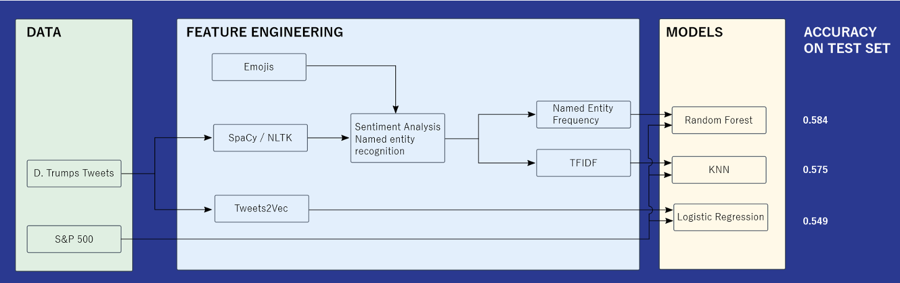
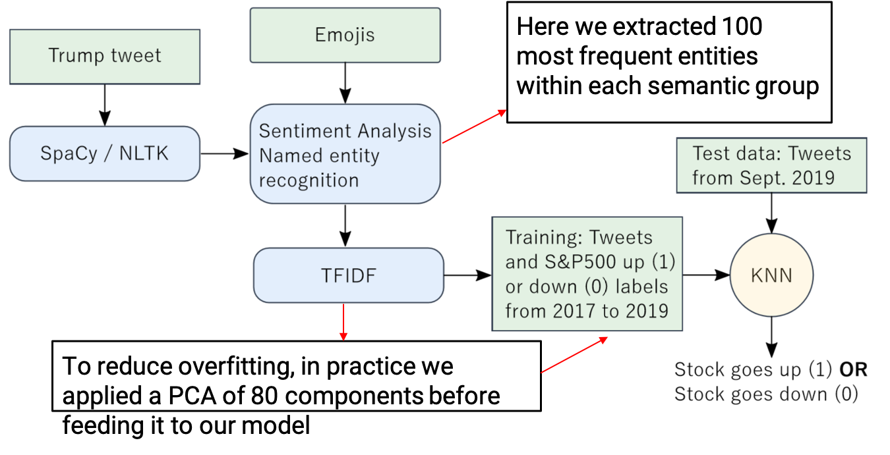
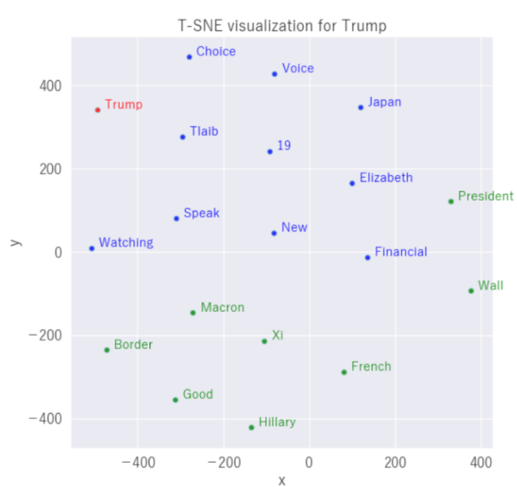

# Predicting S&P500 according to Trump’s tweets through NLP

## CONTEXT
#### Donald Trump’s tweets:
- overpass 2,000 every year over the past three years of his presidency
- are unpredictable and related to the very last news, political or business

*Can it be analyzed through machine learning algorithm as NLP in order to see if tweets have an impact on the US stock exchange index ?*

#### Twitter Data:
- Less than 280 characters
- Organisation, person and events names are included and the symbol "@" and "#"
- Emojis

#### S&P 500 Data:
- Indicator of the economic trends in the U.S. and tends to react to various political, economical and other news
- One closing and opening price for a day

The aim of this project is to, given the twitter feed of Donald Trump, use NLP and binary classification to predict the movement of S&P 500, goes up or down

## DATA PRE-PROCESSING
#### Twitter Data:
- Keep only tweets posted during Trump’s presidency
- Remove retweets
- Remove short tweets (whose word counts are lower than 5)
- Convert timestamps into EST
- Aggregate on a daily and hourly basis

#### S&P 500 Data:
- Aggregate on a daily and hourly basis
- Assign binary labels based on the next period’s market performance

Joining Data: Innerly join the two data sources. Attention: tweets that are outside trading hours are discarded in the hourly dataset

## METHODOLOGY

### Pipeline 1
#### Feature Extraction
- TF-IDF
- SpaCy Feature extraction
    - High-level attributes (TOKEN, LEMMA, NATURE, FUNCTION, ENTITY)
    - Part-Of-Speech Tagging: Indicates the grammatical nature of a word.
    - Syntactical dependency: Indicates relationships between words in the tweets.
    - High-level Named Entity Recognition (NER) : Pre-trained on Wikipedia to distinguish common words from NE.

#### Evaluation
Accuracy: 
- 5-fold CV Training Accuracy: 0.973
- 5-fold CV Validation Accuracy: 0.584
- Accuracy on the holdout set: 0.575

#### Conclusions
Selecting an appropriate tf-idf vocabulary size:
- Too small: under-fitting
- Too large: over-fitting (we have fewer than 1000 rows of data)
- Solution: using a large size of vocabulary and then applying PCA
Criteria for filtering out trivial tweets:
- Word counts
- The presence of certain phrases (e.g. thank you)
- Sentiment scores

### Pipeline 2
#### Doc2Vex implementation
We prepare tweets in order to be the input of Distributed Bag-of-Words
- Text cleaning with BeautifulSoup library
- Tokenization with NLTK library

#### Embedding representation

#### Evaluation
We implement the Distributed Bag-of-Words from gensim library
- Accuracy: 0.505
- F1-score: 0.504

#### Conclusions
We have faced several challenges for this approach:
- Understand the theory behind word2vec and doc2vec
- Get an accurate exploratory data analysis that can improve our feature engineering
- Improve the doc2vec model because of the small data we have
- Get feedback of our model to see where we can have improvements

## Model evaluation - All models
- The performance of each model is evaluated from their accuracy on the test set. 
- The models Frequency of Named Entity & Random Forest and TF-IDF & KNN are overfitting. 
- This conclusion arise from the cross-validation performed. 
- The data set is not large enough to know if the models will generalise well to unseen data.
- Tweet2Vec is more likely to generalize on new data sets.

## Limits
- There are biases in the data as D. Trump’s tweets are written in light of maintaining a certain public image. 
- NLP does not recognise irony and has trouble with negative forms.
- S&P 500 does not solely depend on D. Trump’s tweets. 
- There is a strong time component in the movement of the stock index as well as a dependence on financial news and events.

## Potential Improvements
- The model could be trained on a larger and more specific data set such as the Bloomberg financial news.
- Other model classifying models could be used instead of logistic regression. 
- Time series forecasting model which account for the stock variation time dependency would benefit the model.  

